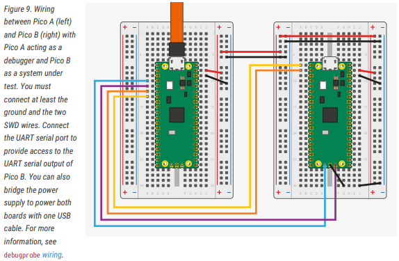
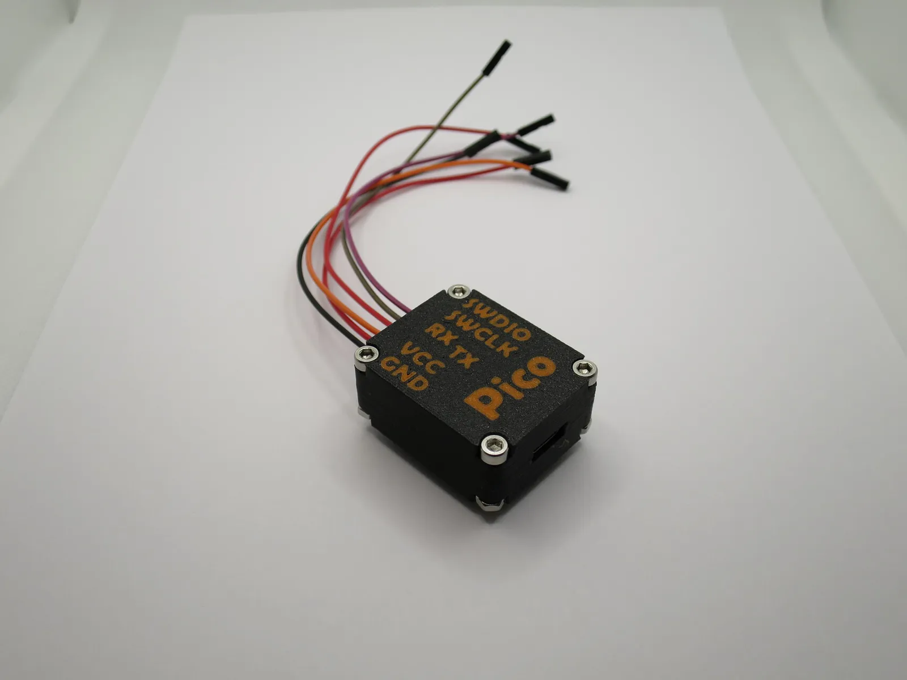

# Setup a Raspberry Pico as Debug Probe

## Wiring

Image from ["Getting Started with Raspberry Pi Pico-series"](https://datasheets.raspberrypi.com/pico/getting-started-with-pico.pdf)

| Pico Debug Probe | Pico Target / Under Test |
| ---------------- | ------------------------ |
| GND              | GND                      |
| GP2              | SWCLK                    |
| GP3              | SWDIO                    |
| GP4/UART1 TX     | GP1/UART0 RX             |
| GP5/UART1 RX     | GP0/UART0 TX             |

There is a neat tiny rp2040 board from Waveshare, the [rp2040-Zero](https://www.waveshare.com/wiki/RP2040-Zero). It works perfectly well as a debug probe. 

## Software

Get the latest software from the Github [repository](https://github.com/raspberrypi/debugprobe/releases). As we use a Pico board as debugger, be sure to pick `debugprobe_on_pico.u2f`.

https://raspberry-projects.com/pi/microcontrollers/programming-debugging-devices/debugging-using-another-pico

## Case for Pico Zero

You can print a [case](https://www.printables.com/de/model/497020-picoprobe-rp2040-zero-case-v2) if you have a 3D printer. 

